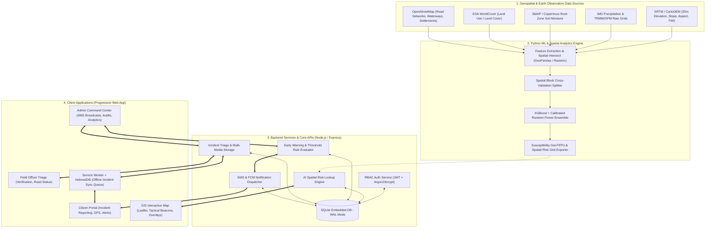
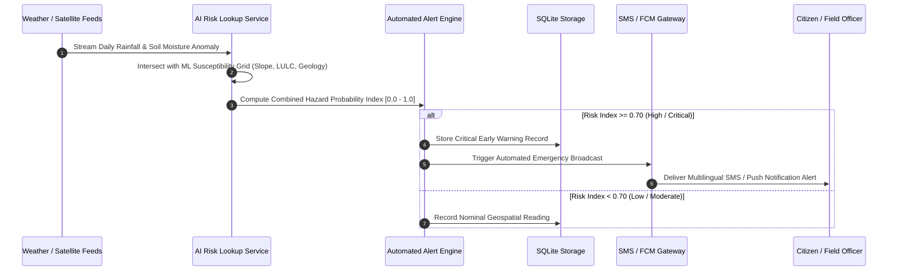
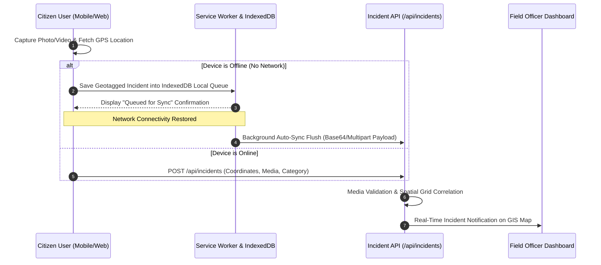
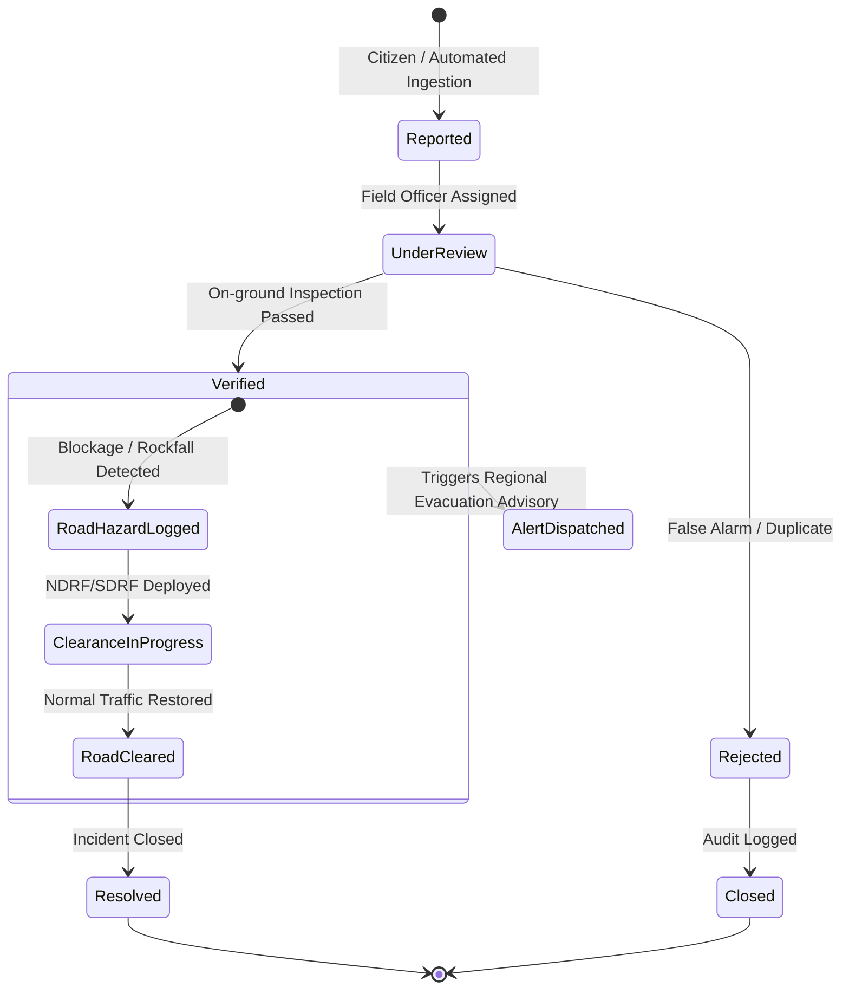

# 🏔️ NEXZORA — AI-Based Landslide Early Warning & Risk Monitoring System
### *Smart India Hackathon (SIH) — North Eastern Region (NER), India*

[](https://nodejs.org/)
[](https://www.python.org/)
[](https://expressjs.com/)
[](https://www.sqlite.org/)
[](https://xgboost.readthedocs.io/)
[](https://leafletjs.com/)
[](LICENSE)

---

## 📌 Executive Summary

The **North Eastern Region (NER) of India** (comprising Assam, Meghalaya, Sikkim, Arunachal Pradesh, Nagaland, Manipur, Mizoram, and Tripura) faces severe geo-hydrological hazards. Monsoonal precipitation, high seismic activity, steep slopes, and fragile young Himalayan lithology make the region exceptionally prone to devastating landslides.

**NEXZORA** is a multi-tier, AI-powered **Early Warning & Landslide Risk Monitoring Platform** designed for disaster management authorities (NDMA, SDMAs, NESAC), field response officers, and citizens. The system integrates:
1. **Satellite Earth Observation & Geospatial Machine Learning Pipeline** for regional susceptibility mapping.
2. **Real-Time Dynamic Risk Scoring Engine** ingesting live precipitation (IMD) and root-zone soil moisture anomalies.
3. **Offline-First Progressive Web App (PWA)** for geotagged citizen incident crowdsourcing and field officer verification.
4. **Automated Multi-Channel Alert & SMS Dispatch Network** providing timely evacuation advisories in regional languages.

---

## 🏛️ System Architecture



---

## 🔄 End-to-End System Workflows

### 1. Landslide Risk Inference & Early Warning Workflow


---

### 2. Citizen Incident Reporting & Offline Sync Workflow (PWA)


---

### 3. Field Officer Triage & Road Hazard Management


---

## 💻 Technology Stack

| Layer | Technology / Library | Purpose & Details |
| :--- | :--- | :--- |
| **Frontend UI / UX** | **Vanilla HTML5 / CSS3 / ES6+** | Pure, lightweight, responsive glassmorphism UI without heavy framework bloat. |
| **PWA & Offline** | **Service Worker (`sw.js`) + IndexedDB** | Full offline incident queuing, automatic background data synchronization, and caching. |
| **GIS & Geospatial Viz** | **Leaflet.js (v1.9.4)** | Interactive map, hazard layers, dynamic radar overlays, custom CSS glowing beacons, and hover glass cards. |
| **Backend Runtime** | **Node.js (v18+) / Express.js (v5.x)** | High-throughput asynchronous REST API server with structured modular routing. |
| **Database Engine** | **SQLite (`better-sqlite3`)** | High-performance embedded ACID database configured with **Write-Ahead Logging (WAL)**. |
| **Authentication & Security** | **JWT + bcryptjs / Argon2** | Role-Based Access Control (Citizen, Field Officer, Admin), HTTP-only cookies, Bearer tokens, CSRF protection. |
| **AI / Machine Learning** | **Python 3.10+, XGBoost, Scikit-Learn** | Spatial Block CV, Calibrated Random Forest & Gradient Boosted Ensembles. |
| **Geospatial Processing** | **GeoPandas, Rasterio, Shapely, PyProj** | Multi-band GeoTIFF processing, DEM slope extraction, TWI computation, vector intersection. |
| **Notification Infrastructure** | **SMS Engine (Fast2SMS/Twilio/MSG91) + FCM** | Multilingual SMS alerting (English, Hindi, Assamese, Bengali) and Web Push notifications. |
| **Testing & CI** | **Node.js Native Test Runner (`node:test`)** | Automated integration and regression test suites covering 80+ unit and route specs. |

---

## 📁 Repository Structure

```
├── .env.example                  # Environment variable template
├── config.yaml                   # Geospatial pipeline & ML configuration
├── index.html                    # Unified Single-Page Application (PWA)
├── package.json                  # Node.js backend dependencies & scripts
├── requirements.txt              # Python geospatial & ML dependencies
├── run_pipeline.py               # End-to-end Python ML training & mapping entry point
├── sw.js                         # Service worker for offline caching & background sync
│
├── assets/                       # Static media, icons, and UI graphics
│
├── models/                       # Trained ML model weights and serialized pipelines
│   ├── full_inference_pipeline.joblib
│   ├── landslide_risk_model.joblib
│   └── preprocessing_pipeline.joblib
│
├── outputs/                      # Generated evaluation reports, GeoTIFFs, and charts
│   ├── confusion_matrix.png
│   ├── feature_importance.csv
│   ├── risk_probability_map.tif
│   ├── roc_curve.png
│   └── uploads/                  # User-submitted incident media attachments
│
├── server/                       # Node.js Backend Server Architecture
│   ├── server.js                 # Express server bootstrap & middleware initialization
│   ├── config.js                 # Configuration loader and environment bindings
│   ├── db.js                     # SQLite schema definitions, indexes, and connection pool
│   │
│   ├── middleware/               # Express request middleware
│   │   ├── auth.js               # JWT authentication & session verification
│   │   └── rbac.js               # Role-based permission guard (Citizen/Officer/Admin)
│   │
│   ├── routes/                   # REST API Controllers
│   │   ├── admin.js              # Admin control center, audit logs, user management
│   │   ├── alerts.js             # Early warning advisory triggers & query endpoints
│   │   ├── auth.js               # Registration, Login, Logout, Profile update
│   │   ├── dashboard.js          # Aggregated regional statistics and analytics
│   │   ├── fieldOfficer.js       # Incident verification, triage, status updates
│   │   ├── incidents.js          # Geotagged incident reporting and upload handlers
│   │   ├── notifications.js      # In-app notifications & push subscription registry
│   │   └── roads.js              # Road condition and hazard status endpoints
│   │
│   └── services/                 # Core Business Logic & External Integrations
│       ├── aiRiskLookup.js       # Real-time spatial risk scoring & grid interpolation
│       ├── alertService.js       # Multi-criteria threshold rule engine
│       ├── audit.js              # Security & administrative audit logger
│       ├── fcmService.js         # Firebase Cloud Messaging push dispatch
│       ├── mediaStorage.js       # Multipart file ingestion & MIME sanitation
│       └── smsService.js         # Multilingual SMS gateway dispatcher
│
├── src/                          # Frontend JS/CSS & Python Data Pipeline Modules
│   ├── css/                      # Modular styling sheets
│   │   ├── components.css        # Glassmorphic cards, beacons, tooltips, buttons
│   │   ├── layout.css            # Responsive grids, sidebar navigation, headers
│   │   └── theme.css             # Dark/Light mode color tokens & variables
│   │
│   ├── js/                       # Client-side ES6 modules
│   │   ├── alerts.js             # Alert feed management & real-time polling
│   │   ├── app.js                # Core SPA state orchestrator & view router
│   │   ├── auth.js               # Authentication client, token storage & session logic
│   │   ├── dashboard.js          # Chart.js analytics & regional risk widgets
│   │   ├── data.js               # GeoJSON layer definitions & mock spatial feeds
│   │   ├── map.js                # Leaflet map engine, tactical markers & hover cards
│   │   ├── offline-store.js      # IndexedDB storage for offline report queue
│   │   └── report.js             # Incident reporting modal, media preview & GPS capture
│   │
│   └── python/                   # Python Feature Engineering & ML Scripts
│       ├── dataset_builder.py    # Spatial point sampling & matrix builder
│       ├── dataset_inspector.py  # Data quality checks, CRS verification, missingness
│       ├── evaluator.py          # ROC, PR curves, Confusion Matrix generation
│       ├── model_trainer.py      # Spatial Block CV & XGBoost training
│       ├── risk_mapper.py        # Susceptibility GeoTIFF raster generator
│       ├── terrain_features.py   # DEM slope, aspect, curvature, TWI extraction
│       ├── rainfall_features.py  # Precipitation cumulative anomaly processing
│       └── soil_moisture_features.py # Root-zone moisture processing
│
└── test/                         # Automated Unit & Integration Test Suites
    ├── alerts.test.js            # Early warning generation & threshold test suite
    ├── auth.test.js              # Authentication, password hashing, and RBAC tests
    ├── dashboard_and_sms.test.js # Analytics queries & SMS gateway integration tests
    ├── incidents.test.js         # Report creation, triage, and attachment tests
    └── location.test.js          # GPS coordinate validation & spatial bounding tests
```

---

## 📡 REST API Reference Summary

### Authentication & User Profiles
- `POST /api/auth/register` — Register citizen or officer account (with role request).
- `POST /api/auth/login` — Authenticate and receive JWT session token.
- `GET /api/auth/me` — Retrieve active profile, role, and jurisdiction.
- `PUT /api/auth/profile` — Update phone number, emergency contacts, or display name.

### Incident Management
- `POST /api/incidents` — Submit geotagged incident report (supports base64/multipart photo/video).
- `GET /api/incidents` — Query active incidents (filterable by status, severity, district).
- `GET /api/incidents/:id` — Fetch incident details with full verification history.
- `PATCH /api/field-officer/incidents/:id/status` — *(Officer/Admin)* Update triage status (`Verified`, `Rejected`, `Under Review`).

### Early Warnings & Alerts
- `GET /api/alerts` — Fetch active early warnings and advisories.
- `POST /api/alerts/evaluate` — Trigger AI multi-criteria threshold evaluation.
- `POST /api/alerts/broadcast` — *(Admin)* Dispatch broadcast advisory via SMS & Push.

### Road & Infrastructure Status
- `GET /api/roads` — Get current road trafficability and hazard statuses.
- `POST /api/roads/update` — *(Officer/Admin)* Mark road section as Blocked, Partially Blocked, or Clear.

### Spatial Risk Lookup
- `POST /api/internal/risk-lookup` — Query real-time AI susceptibility probability for given `(latitude, longitude)`.

---

## 🚀 Setup & Installation Guide

### 1. Prerequisites
- **Node.js**: v18.0.0 or higher
- **npm**: v9.0.0 or higher
- **Python**: 3.10 or higher (for running the ML training pipeline)
- **Git**: Installed and configured

---

### 2. Environment Configuration
Clone the repository and copy the environment template:
```bash
git clone https://github.com/SUBHRADIP-ADHIKARI7/NexZora_SIH_ROUND-2.git
cd NexZora_SIH_ROUND-2
cp .env.example .env
```

Edit `.env` with your preferred settings:
```env
PORT=3000
NODE_ENV=development
JWT_SECRET=your_super_secret_jwt_key_here
FAST2SMS_API_KEY=your_fast2sms_api_key_optional
FCM_SERVER_KEY=your_firebase_cloud_messaging_key_optional
```

---

### 3. Backend & Frontend Server Setup
Install Node.js dependencies and launch the server:
```bash
# Install dependencies
npm install

# Run database migrations and start server
npm start
```
The application will be live at: **`http://localhost:3000`**

---

### 4. Running the Python Geospatial ML Pipeline (Optional)
To retrain the landslide susceptibility model and regenerate GeoTIFF maps from raw GIS data:
```bash
# Create virtual environment
python -m venv venv
source venv/bin/activate  # On Windows: venv\Scripts\activate

# Install geospatial dependencies
pip install -r requirements.txt

# Execute end-to-end ML pipeline
python run_pipeline.py
```

---

### 5. Running Automated Test Suites
NEXZORA includes an automated test harness covering security, endpoints, database transactions, and business rules:
```bash
# Run all test suites
node --test test/*.test.js
```

---

## 🔒 Security & Reliability Architecture

1. **Role-Based Access Control (RBAC)**: Strict permission boundaries ensuring citizens cannot approve alerts or modify road statuses, while field officers and admins have auditable elevation privileges.
2. **Defensive Storage**: Zero-latency local SQLite operations backed by Write-Ahead Logging (WAL) preventing write-lock contentions during high-concurrency disaster events.
3. **Data Protection**: Argon2 / bcrypt password hashing with unique salts, parameterized prepared SQL statements to prevent SQL Injection, and input sanitation on all file uploads.
4. **Resilience During Disasters**: Offline-first design ensures citizens in zero-connectivity hilly terrains can still capture critical landslide events with GPS coordinates, which sync automatically once cellular connectivity is re-established.

---

## 👥 Contributors & Acknowledgments
- **Team NEXZORA** — Smart India Hackathon (SIH)
- **Geospatial & Earth Observation References**: Geological Survey of India (GSI), National Remote Sensing Centre (NRSC), North Eastern Space Applications Centre (NESAC), India Meteorological Department (IMD).

---

## 📄 License
This project is licensed under the MIT License — see the [LICENSE](LICENSE) file for details.
