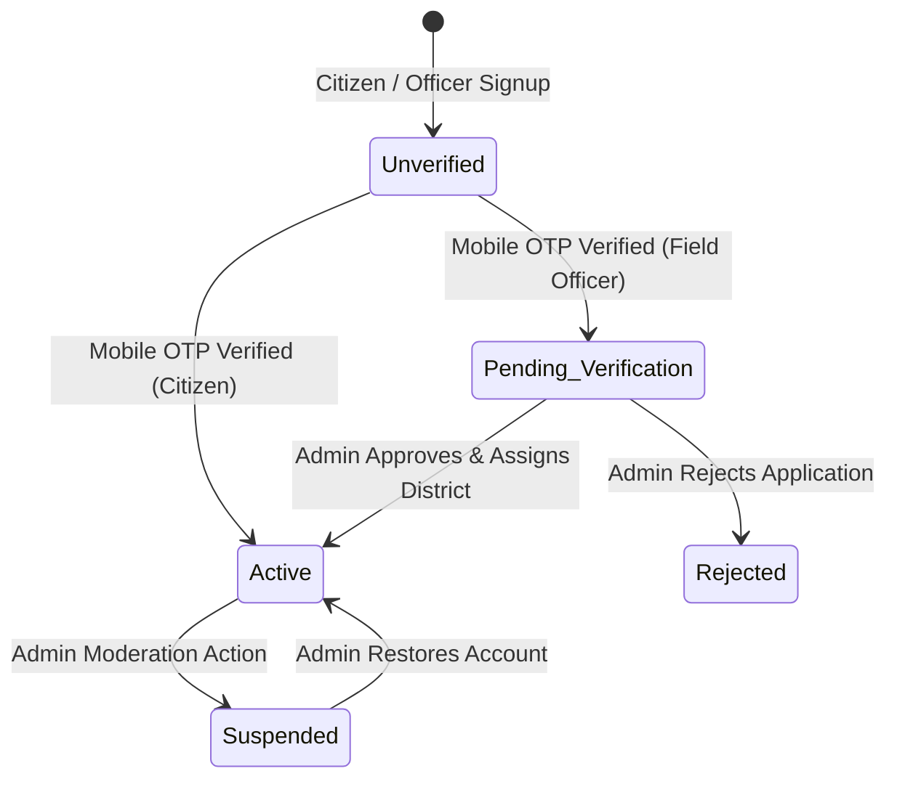

# NEXZORA — Authentication & Role-Based Access Control (RBAC) Architecture

## 1. System Overview

NEXZORA is an AI-driven Early Warning and Landslide Risk Monitoring System designed for the North Eastern Region (NER) of India. The system enforces a zero-trust, multi-tiered Role-Based Access Control (RBAC) model supporting three distinct operational roles:

1. **Citizen**: Public user responsible for monitoring regional hazard levels, route connectivity, and submitting geotagged incident evidence.
2. **Field Officer**: Geotechnical and disaster response personnel authorized to inspect assigned district incidents, verify field evidence, update road statuses, and submit emergency alerts.
3. **Admin**: State and central disaster management authorities with global oversight of all NER districts, user moderation, Field Officer assignments, CAP emergency broadcasts, and system audit logs.

```mermaid
flowchart TD
    subgraph Client [Frontend Client]
        AuthModal[Auth & Registration Wizard]
        NavGuards[Client-Side Role Guards]
        CitizenView[Citizen Map & Reports]
        FieldView[Field Officer Console]
        AdminView[Admin Control Room]
    end

    subgraph API [Backend API & Middleware Layer]
        AuthRouter[/api/auth/*]
        UserRouter[/api/users/*]
        OfficerRouter[/api/field-officer/*]
        AdminRouter[/api/admin/*]
        ReportRouter[/api/reports/*]
        RateLimiter[Sliding Window Rate Limiter]
        JWTMiddleware[JWT Signature & Expiry Guard]
        RBACMiddleware[Role & District Authorization Guard]
    end

    subgraph Database [SQLite Storage & Audit Layer]
        UsersTable[(users)]
        AssignmentsTable[(officer_assignments)]
        SessionsTable[(auth_sessions)]
        AuditLogsTable[(audit_logs)]
        ReportsTable[(incident_reports)]
        RoadsTable[(roads)]
        AlertsTable[(alerts)]
    end

    AuthModal --> AuthRouter
    NavGuards --> JWTMiddleware
    JWTMiddleware --> UsersTable
    RBACMiddleware --> AssignmentsTable
    OfficerRouter --> ReportsTable
    OfficerRouter --> RoadsTable
    AdminRouter --> UsersTable
    AdminRouter --> AuditLogsTable
    ReportRouter --> ReportsTable
```

---

## 2. Authentication & Security Principles

### 2.1 Password Security
- Passwords are encrypted using **bcrypt** with a cost factor of `10` rounds and unique cryptographic salts.
- Plain-text passwords are never logged, stored, or returned in API responses.

### 2.2 Token & Session Management
- **Access Tokens**: Short-lived JSON Web Tokens (15-minute lifespan) signed with `HS256` using secure, environment-defined secrets.
- **Refresh Tokens**: Long-lived tokens (7-day lifespan) stored in `HttpOnly`, `SameSite=Lax` cookies and hashed in the `auth_sessions` table.
- **Session Revocation**: Logout or account status changes (`suspended`/`rejected`/`password_reset`) immediately revoke active refresh tokens in the database.

### 2.3 Rate Limiting & Abuse Prevention
- In-memory sliding-window rate limiters are applied to sensitive authentication and OTP endpoints to prevent brute-force attacks.
- Mobile numbers and email addresses are checked with generic error responses during login and password recovery to prevent user enumeration attacks.

### 2.4 Prevention of Privilege Escalation & IDOR
- Public registration endpoints reject any request claiming the `admin` role (`403 Forbidden`).
- User profile update endpoints (`PATCH /api/users/me`) strictly ignore `role` and `account_status` fields.
- Incident report queries (`GET /api/reports/:id`) independently verify that the requester is either the original reporter, an active Field Officer assigned to that district, or an Admin.

---

## 3. Account Lifecycle & State Machine



---

## 4. Audit Logging Mechanism

Every security-sensitive action generates an immutable audit record in the `audit_logs` table:

- **Actor Details**: `actor_user_id`, `actor_name`, `actor_role`, `ip_address`
- **Target Entity**: `entity_type` (`user`, `officer_assignment`, `incident_report`, `road`, `alert`), `entity_id`
- **Action Type**: `account_registered`, `otp_verified`, `login_success`, `login_failed`, `user_status_changed`, `role_changed`, `officer_assigned`, `report_verified`, `road_status_updated`, `alert_approved`, `password_reset`
- **State Diffs**: `old_value_summary` and `new_value_summary` (sanitized of sensitive keys).
