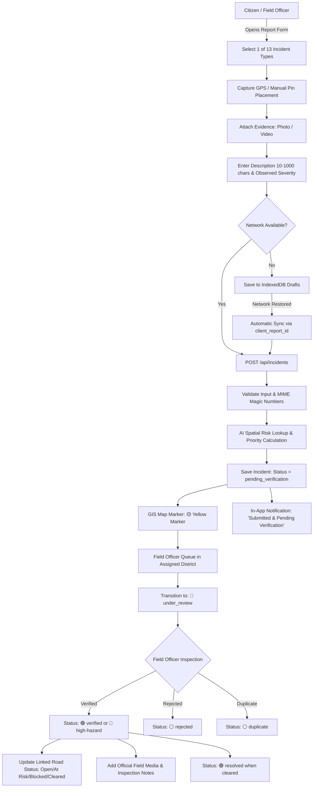

# NEXZORA Incident Reporting Architecture & Specification

## 1. System Overview
The **Incident Reporting System** in NEXZORA enables on-the-ground Citizens and Field Officers across the North Eastern Region (NER) of India to report dangerous landslide hazards, road blockages, structural failures, and geological anomalies.

The system integrates real-time GPS telemetry, mobile-first responsive camera capture, offline-first IndexedDB synchronization, spatial AI landslide hazard correlation, role-based district verification, road connectivity updates, and GIS map markers.

---

## 2. Core Architecture & Workflow Lifecycle

---

## 3. Role-Based Access Control Matrix

| Feature / Action | Citizen | Field Officer | Administrator |
| :--- | :---: | :---: | :---: |
| Submit Incident Report | ✅ | ✅ | ✅ |
| Attach Media (Photos ≤10MB, Video ≤50MB) | ✅ | ✅ | ✅ |
| Use GPS / Drag Pin on Mini-Map | ✅ | ✅ | ✅ |
| View Own Submitted Reports | ✅ | ✅ | ✅ |
| Edit Draft / Pending Verification Reports | ✅ (Own only) | ✅ (Own only) | ✅ |
| View Reports Outside Assigned District | ❌ | ❌ (Strict 403) | ✅ (All NER) |
| Move Status: Pending → Under Review | ❌ | ✅ (Assigned District) | ✅ |
| Move Status: Under Review → Verified / Rejected | ❌ | ✅ (Assigned District) | ✅ |
| Mark Incident Resolved | ❌ | ✅ (Assigned District) | ✅ |
| Update Linked Road Status (Open / Blocked / Cleared) | ❌ | ✅ (Assigned District) | ✅ |
| Mark Duplicate Incident Report | ❌ | ❌ | ✅ |
| Moderate / Reject Inappropriate Media | ❌ | ❌ | ✅ |
| Access Security Audit Trail | ❌ | ❌ | ✅ |

---

## 4. AI Landslide Hazard Lookup & Priority Scoring

### Spatial Risk Lookup
When an incident is submitted with latitude and longitude:
1. The backend (`server/services/aiRiskLookup.js`) calculates the Haversine distance from the incident coordinates to known geological hazard centroids in NER (e.g., East Khasi Hills, Champhai, Dima Hasao, Gangtok, etc.).
2. It derives:
   - `ai_risk_probability` (0.0 to 1.0)
   - `ai_risk_class` (`Critical`, `High`, `Medium`, `Low`)
   - `AI_data_timestamp`
3. **Resilience Principle**: If AI services or rainfall feeds are temporarily unavailable, report submission **never fails**. It defaults to `"AI risk data unavailable"`.
4. **AI Safety Rule**: Ground citizen reports **never** automatically retrain or mutate the core AI machine learning models without formal verification, sanitization, and administrative sign-off.

### Prototype Decision-Support Priority Score
Field Officer and Admin dashboards automatically compute a weighted prototype priority score:
- **Critical (75-100)**: Major Landslide, Road Fully Blocked, High/Critical AI Risk, or High Observed Severity.
- **High (50-74)**: Slope Movement, Damaged Bridge, Medium AI Risk.
- **Medium (25-49)**: Minor Landslide, Falling Rocks, Partial Blockage.
- **Low (0-24)**: Small crack, small debris, clear road.

---

## 5. Offline-First PWA & Synchronization Engine

1. **Client Storage**: Powered by IndexedDB (`nexzora_offline_db`, store: `offline_reports`).
2. **Offline Drafting**: When offline (`navigator.onLine === false` or fetch network failure), the report is stored with client status `pending_sync` and a unique UUID `client_report_id`.
3. **Automatic Sync**: The system listens to the browser `online` window event and executes `window.OfflineStore.syncAllPending()`.
4. **Idempotency**: The server checks `client_report_id`. If already submitted, it returns the existing report rather than creating duplicate records.
5. **UI Indicators**: An interactive status pill (`#syncIndicator`) displays `⏳ 2 Pending Sync` when drafts exist and `⚡ Sync Now` for manual trigger.

---

## 6. GIS Map Marker System

| Marker Pin Color | Status / Condition | Visual Icon / Glow |
| :--- | :--- | :--- |
| 🟡 **Yellow** | `pending_verification` | Pulsing Yellow Glow |
| 🔵 **Blue** | `under_review` | Pulsing Blue Glow |
| 🟢 **Green** | `verified` (Normal Severity) | Stable Green Badge |
| 🔴 **Red** | `verified` High-Severity / `Major Landslide` / `Fully Blocked` | High-Intensity Red Flare Pulse |
| ⚪ **Grey** | `rejected` / `duplicate` | Muted Neutral Badge |
| 🟣 **Purple** | `resolved` | Cleared Status Badge |

Every marker card popup includes:
- Incident type & category icon
- Verification status tag
- Exact locality, district, and road name
- Observed severity vs. Spatial AI Risk probability
- Description snippet & media attachment count
- "View Incident Details" button linking directly to the inspection and timeline view.
